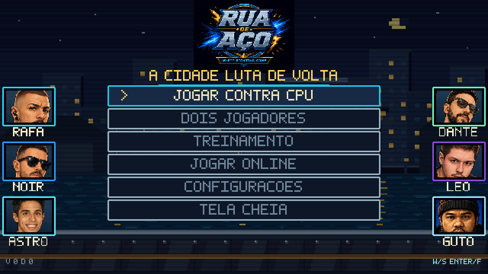
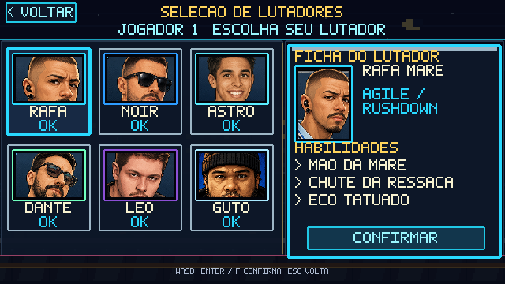
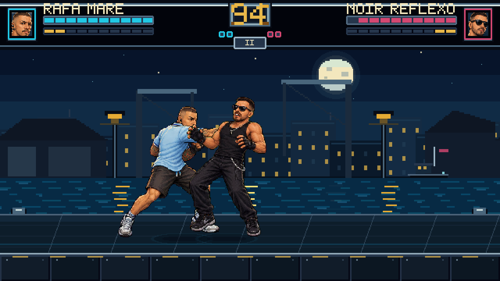
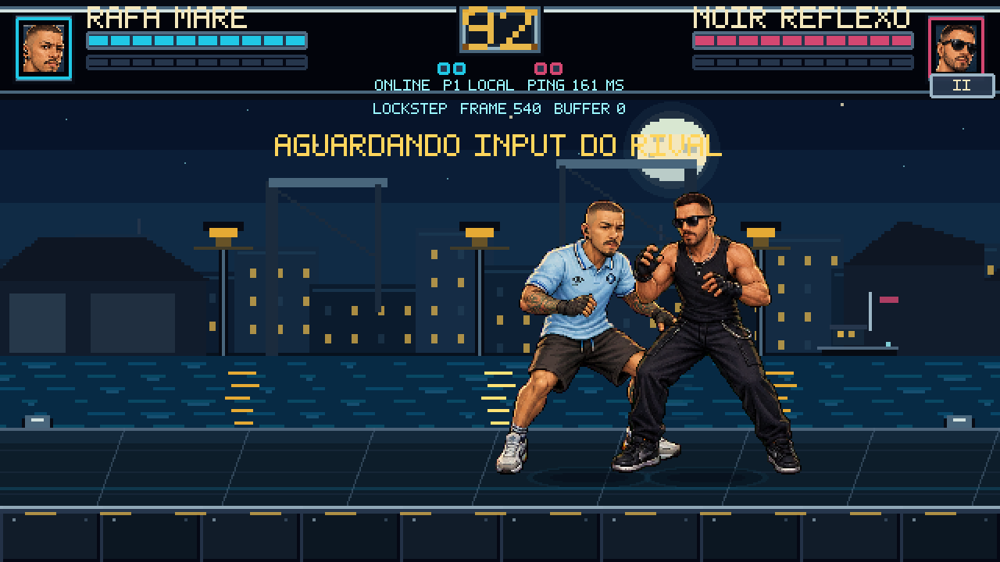
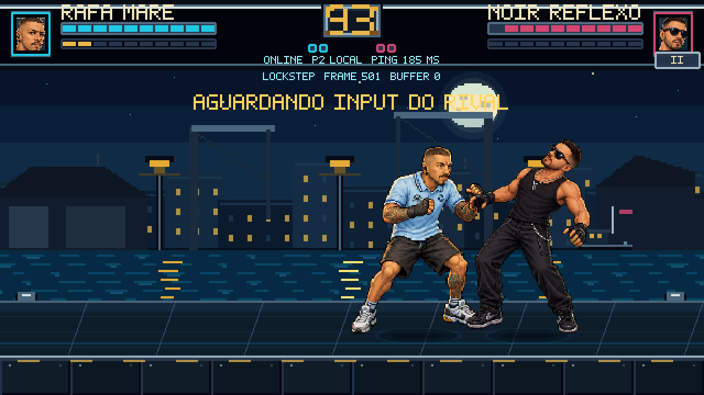

# Rua de Aço

Jogo de luta 2D em pixel art para navegador, com modos local, treinamento, CPU e **multiplayer online funcionando**.

**▶️ [Jogar agora](https://mikerock12.github.io/RuaDeAco/)**



## Destaques

- 6 lutadores jogáveis, cada um com golpes, especiais e frame data próprios;
- melhor de três rounds;
- suporte a teclado, controles touch e gamepad;
- PWA instalável e APK Android via Capacitor;
- multiplayer por sala privada;
- simulação de combate determinística;
- testes unitários, de servidor e E2E;
- publicação automática no GitHub Pages.

## Stack

| Camada | Tecnologia |
| --- | --- |
| Linguagem | TypeScript |
| Engine | Phaser 4 |
| Build | Vite 8 |
| Servidor | Cloudflare Workers + Durable Objects |
| Persistência do servidor | SQLite |
| Rede | HTTPS + WebSocket |
| Mobile | Capacitor |
| Testes | Vitest + Playwright |

## Arquitetura do combate

A simulação fica separada da renderização. Dano, alcance, hit stun, agarrões e projéteis vivem em `src/combat/`; o Phaser cuida de entrada e desenho.

Isso permite que dois clientes executem a mesma luta de forma determinística.

## Multiplayer online

O servidor transporta **inputs**, não simula o combate.

```text
Jogador 1 ──┐                         ┌── Jogador 2
            │ HTTPS + WebSocket       │
            └────► Cloudflare ◄───────┘
                    Worker
                      │
                Durable Object
                sala + SQLite
```

Cada jogador executa localmente a mesma simulação a 60 Hz. Os inputs são enviados em lotes e aplicados com atraso fixo. A cada 60 frames, os clientes enviam um hash do estado para detectar divergências.

Quando a rede atrasa além da janela prevista, o jogo segura o frame em vez de continuar com estados diferentes.

## Telas

| Seleção | Partida |
| --- | --- |
|  |  |

| Online P1 | Online P2 |
| --- | --- |
|  |  |

## Testes

```bash
npm run typecheck
npm test
npm run build
```

O projeto possui testes do motor de combate e do servidor, além de testes end-to-end com Playwright.

## Como rodar

```bash
git clone https://github.com/mikerock12/RuaDeAco.git
cd RuaDeAco
npm install
npm run dev
```

Para o servidor multiplayer, consulte [`server/README.md`](server/README.md).

## Documentação técnica

- [Arquitetura do servidor multiplayer](docs/MULTIPLAYER_SERVER_ARCHITECTURE.md)
- [Arquitetura do cliente online](docs/ONLINE_CLIENT_ARCHITECTURE.md)
- [Pipeline de arte e sprites](docs/PIPELINE_DE_ARTE.md)
- [Beta Android](README_ANDROID_BETA.md)
- [Plano de melhorias com prioridade mobile](PLANO_MELHORIAS_RUA_DE_ACO.md)
- [Auditoria de jogabilidade mobile](docs/AUDITORIA_MOBILE_2026-09-06.md)
- [Testes automatizados no GitHub](docs/CI.md)

## Autor

**Maicon Nunes** — [@mikerock12](https://github.com/mikerock12)
