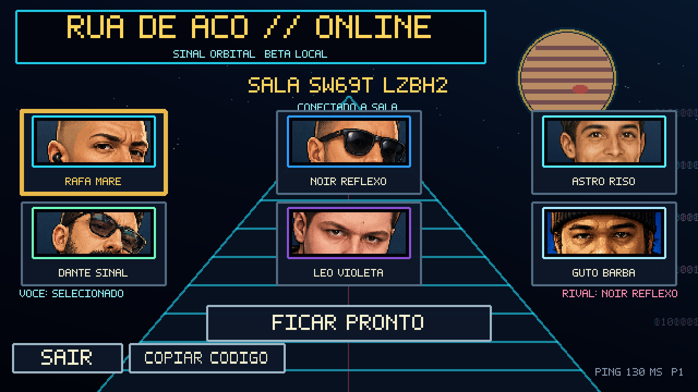
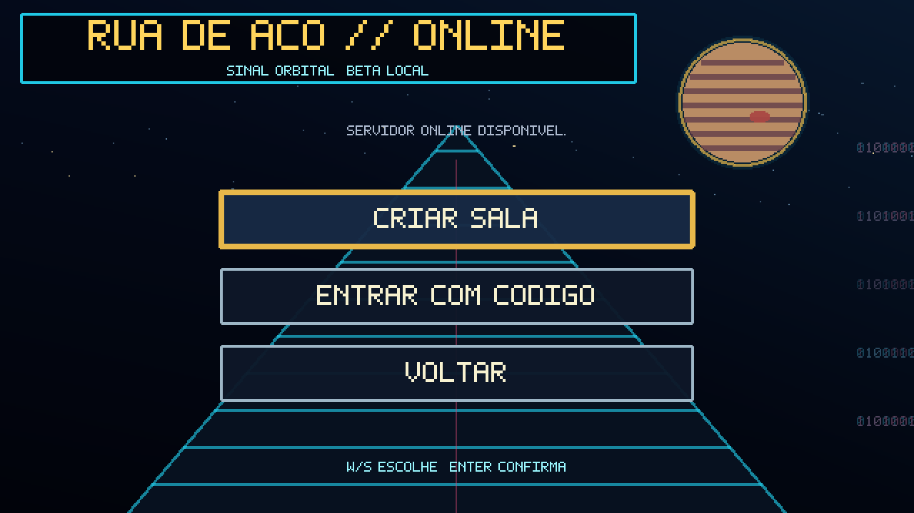

# Rua de Aço

Jogo de luta 2D em pixel art que roda no navegador, com **multiplayer online
funcionando**: dois jogadores em máquinas diferentes lutam na mesma partida por
um código de sala.

**▶️ Jogar agora: <https://mikerock12.github.io/RuaDeAco/>**


## O que está pronto

- **6 lutadores jogáveis** — Rafa Maré, Guto Barba, Noir Reflexo, Astro Riso,
  Dante Sinal e Léo Violeta, cada um com golpes, especiais e frame data próprios.
- **4 modos** — contra a CPU, dois jogadores no mesmo teclado, treinamento
  (hitboxes visíveis, vida e energia infinitas) e **online**.
- **Luta melhor de três rounds** na arena Cais da Cidade, em passo fixo de 60 Hz.
- **Multiplayer online** por sala privada, com servidor próprio em produção.
- **Roda em qualquer lugar** — navegador desktop, celular (controles touch),
  gamepad, PWA instalável com modo offline e APK Android via Capacitor.

## Como é por dentro

| Camada | Tecnologia |
| --- | --- |
| Linguagem | **TypeScript** (cliente e servidor, sem JavaScript solto) |
| Motor | **Phaser 4.1** com renderização pixel art em 640 × 360 |
| Build | **Vite 8** — sem React, sem framework de UI |
| Servidor online | **Cloudflare Workers** + **Durable Objects** com SQLite |
| Mobile | **Capacitor 8** (APK Android) |
| Testes | **Vitest** (438 unitários + 66 no servidor) e **Playwright** (E2E) |
| Publicação | GitHub Pages via GitHub Actions |

O combate é uma simulação determinística própria: dano, alcance, hit stun,
agarrões e projéteis vivem em `src/combat/`, separados do desenho. O Phaser
cuida só da tela e da entrada — nada de física automática.

## Telas

| Seleção de lutadores | Luta local |
| --- | --- |
|  |  |

## Como funciona o modo online

O servidor **transporta inputs, não simula a luta**. Os dois clientes rodam a
mesma simulação de 60 Hz e só trocam os botões pressionados — o clássico
*lockstep* com atraso fixo.

```text
Jogador 1 ──┐                                        ┌── Jogador 2
            │  HTTPS + WebSocket                     │
            └──►  Cloudflare Worker  ◄───────────────┘
                  sessão HMAC · ticket · CORS
                          │
                  Durable Object "GameRoom"
                  SQLite · slots · relay de inputs
```

1. **Sala** — um jogador cria a sala e recebe um código de 10 caracteres; o
   outro entra digitando esse código. Dois jogadores por sala, sem espectadores.
2. **Autenticação** — o Worker emite uma sessão convidada assinada com HMAC-SHA-256
   e um ticket de 45 segundos, usado só no subprotocolo do WebSocket (nunca na URL).
3. **Sincronia** — cada sala é um Durable Object isolado com SQLite, que guarda
   slots, seleção, seed e prontidão, e hiberna quando ninguém está conectado.
4. **Inputs** — cada frame vira uma máscara de 8 bits (direções + fraco, forte,
   especial e defesa) enviada em lotes de até 3 frames. O servidor valida a
   sequência e repassa ao rival, sem opinar sobre dano ou vitória.
5. **Atraso** — 8 frames (~133 ms) de input delay dão tempo para o pacote chegar.
   Quando a rede atrasa mais que isso, o jogo segura o frame e avisa
   `AGUARDANDO INPUT DO RIVAL` em vez de dessincronizar.
6. **Verificação** — a cada 60 frames os dois lados enviam um hash canônico do
   estado completo. Hashes diferentes = divergência detectada na hora.

| Sala online (código + seleção) | Servidor disponível |
| --- | --- |
|  |  |

A mesma partida, vista pelos dois clientes ao mesmo tempo — repare no HUD com
`ONLINE`, ping real e o frame do lockstep:

| Jogador 1 | Jogador 2 |
| --- | --- |
|  |  |

Ainda não existem ranking, matchmaking, rollback ou reconexão no meio da luta:
o online é uma beta privada de duas pessoas por código de sala.

## Rodar localmente

```bash
npm install
npm run dev
```

Validação:

```bash
npm run typecheck && npm test && npm run build
```

Para subir também o servidor online na sua máquina, veja
[`server/README.md`](server/README.md).

## Controles

| Ação | Jogador 1 | Jogador 2 |
| --- | --- | --- |
| Mover | A / D | Setas ← → |
| Pular / agachar | W / S | Setas ↑ ↓ |
| Ataque fraco | F | J |
| Ataque forte | G | K |
| Especial | H | L |
| Defesa | R | U |
| Confirmar / pausar | Enter / Esc | — |

As teclas são remapeáveis em Configurações. No celular o jogo mostra direcional
e botões na tela automaticamente, com suporte a múltiplos toques. Gamepads são
reconhecidos ao conectar. No treinamento, F1 alterna as hitboxes, F2 reposiciona
e F3 liga ou desliga a CPU.

## Documentação

- [Arquitetura do servidor multiplayer](docs/MULTIPLAYER_SERVER_ARCHITECTURE.md)
- [Arquitetura do cliente online](docs/ONLINE_CLIENT_ARCHITECTURE.md)
- [Pipeline de arte e sprites](docs/PIPELINE_DE_ARTE.md)
- [Beta Android](README_ANDROID_BETA.md)

## Requisitos

Node.js 20.19+ e npm 10+ para o jogo; Node 22+ para o servidor. Em produção o
PWA exige HTTPS.
